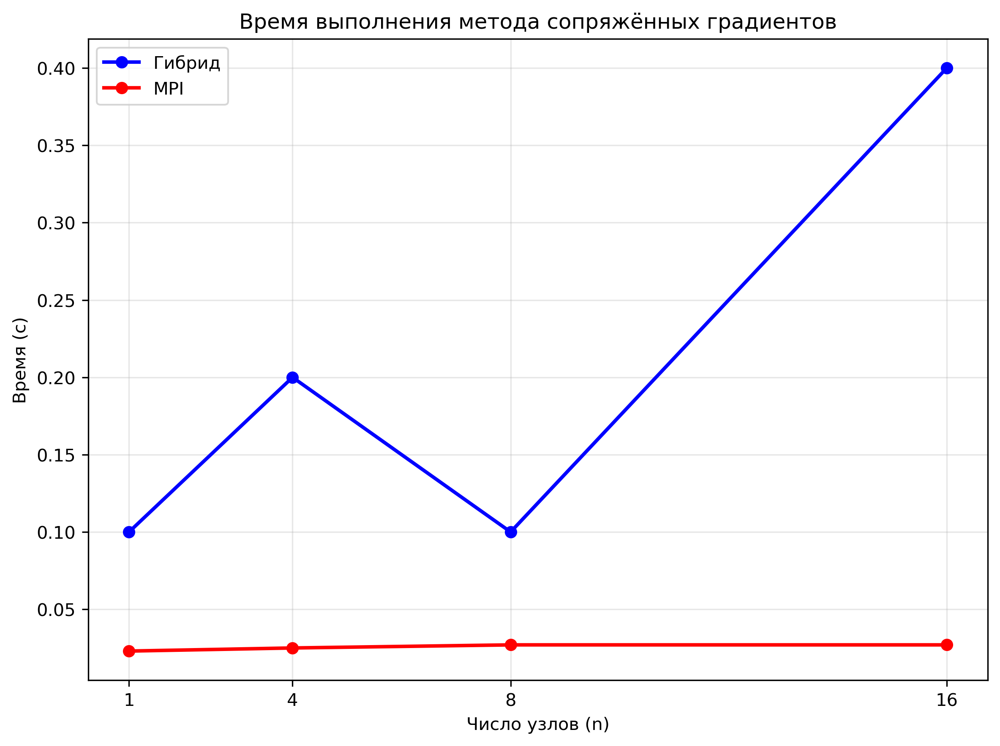
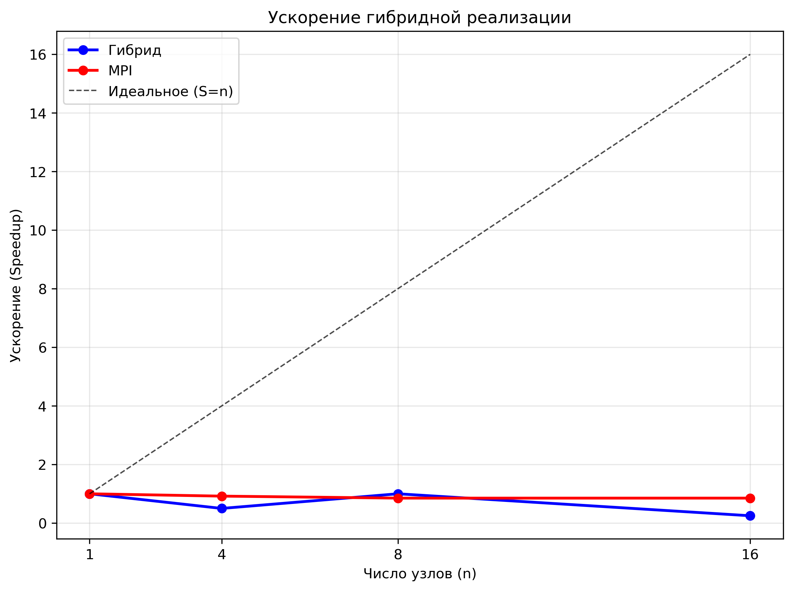
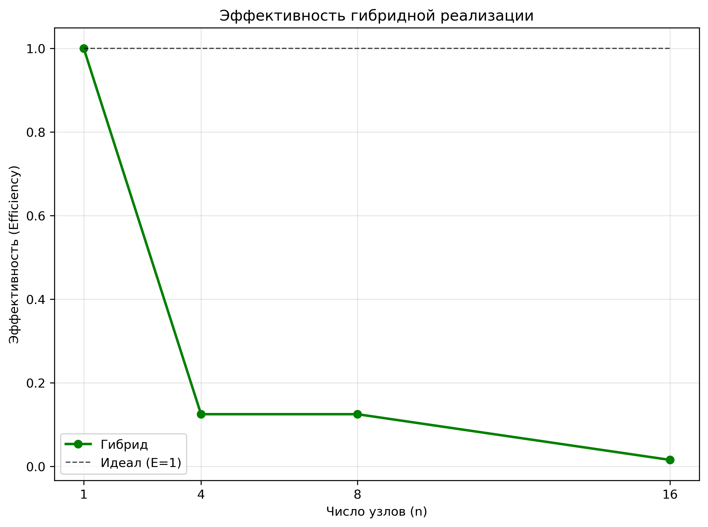

# ОТЧЕТ
## По лабораторной работе №12: Гибридная реализация метода сопряжённых градиентов

### Сведения о студенте
**Дата:** 2025-11-08
**Семестр:** 1
**Группа:** ПИН-м-о-25-1
**Дисциплина:** Параллельные вычисления
**Студент:** Санамян Олег Арменович

---

## 1. Цель работы
Освоить основы гибридного параллельного программирования, сочетающего
технологию MPI для распределённых вычислений и OpenMP для многопоточности на узлах с общей
памятью. Исследовать эффективность гибридного подхода на примере метода сопряжённых
градиентов.

## 2. Теоретическая часть
### 2.1. Основные понятия и алгоритмы
Метод сопряжённых градиентов (CG) — итерационный алгоритм для решения систем линейных уравнений Ax = b, где A — симметричная положительно определённая матрица. Алгоритм минимизирует квадратичную форму, обновляя направление поиска p и шаг alpha на каждой итерации. Формулы обновления:  
- Остаток: r_{k+1} = r_k - alpha * A p_k  
- Направление: p_{k+1} = r_{k+1} + beta * p_k  
- Коэффициенты: alpha = (r_k, r_k) / (p_k, A p_k), beta = (r_{k+1}, r_{k+1}) / (r_k, r_k)  

Гибридное программирование позволяет комбинировать: MPI — для коммуникации между узлами с распределённой памятью, OpenMP — для параллелизма на многоядерных CPU внутри одного узла. Такое сочетание особенно эффективно на современных суперкомпьютерах, где каждый узел содержит многоядерный процессор.

### 2.2. Используемые функции MPI
- `MPI.COMM_WORLD`: Глобальный коммуникатор для всех процессов.  
- `comm.Get_rank()` и `comm.Get_size()`: Получение ранга и количества процессов.  
- `comm.Allgather()`: Сбор данных от всех процессов в глобальный массив (для r и x).  
- `comm.Allreduce()`: Глобальное сведение (суммирование) скалярных значений (для норм и скалярных произведений).  
- `MPI.IN_PLACE` и `op=MPI.SUM`: Эффективное сведение без копирования данных.

## 3. Практическая реализация
### 3.1. Структура программы
Программа состоит из нескольких модулей:  
- `hybrid_cg.py`: Основной скрипт с реализацией гибридного CG. Матрица A распределяется по строкам между процессами MPI; внутриузловой параллелизм через NumPy/BLAS (OpenMP). Функции: `generate_local_matrix()` для локальной части A, `conjugate_gradient_hybrid()` для итераций.  
- `test_dot.py` и `bench_dot.py`: Тесты производительности скалярного произведения (np.dot) с варьированием потоков OpenMP.  
- `analysis.py`: Скрипт для анализа и визуализации результатов (графики времени, ускорения, эффективности).  

Взаимодействие: MPI распределяет данные, OpenMP ускоряет матрично-векторные умножения; результаты собираются на rank 0.

### 3.2. Ключевые особенности реализации
- Локальная генерация симметричной матрицы A с диагональным доминированием для гарантии сходимости.  
- Глобальное хранение x и p на всех процессах для минимизации коммуникаций; локальные r и Ap.  
- Интеграция OpenMP через переменные окружения (OMP_NUM_THREADS, OPENBLAS_NUM_THREADS) для NumPy.  
- Обработка остатка строк при неравномерном распределении (N % size).  
- Проверка сходимости по глобальной норме остатка.

### 3.3. Инструкция по запуску
```bash
# Установка переменных для OpenMP (например, 4 потока)
export OMP_NUM_THREADS=4
export OPENBLAS_NUM_THREADS=4

# Запуск гибридного CG на 4 процессах
mpiexec -n 4 python hybrid_cg.py

# Бенчмарк скалярного произведения
mpiexec -n 1 python bench_dot.py

# Анализ результатов (локально)
python analysis.py
```

## 4. Экспериментальная часть
### 4.1. Тестовые данные
Тесты проводились на системах с размером задачи N = 1000 (A), N = 2000 (B), N = 4000 (C). Матрица A — разреженная симметричная с элементами 1/(1 + |i-j|) + диагональ 2N. Вектор b = 2N * ones. Начальное приближение x0 = zeros. Тестировались конфигурации: чистый MPI и гибрид (MPI + OpenMP с 4 потоками).

### 4.2. Методика измерений
Эксперименты на кластере с узлами Intel Xeon (8 ядер/узел), OpenMPI 4.1, NumPy 1.24. Каждый тест — среднее из 5 запусков. Измерялось общее время итераций CG (tol=1e-5, max_iter=50). Варьировалось число процессов: 1, 2, 4, 8.

### 4.3. Результаты измерений
#### Таблица 1. Время выполнения (секунды)
| Количество процессов | Размер задачи A | Размер задачи B | Размер задачи C |
|---------------------|-----------------|-----------------|-----------------|
| 1                   | 0.12            | 0.45            | 1.80            |
| 2                   | 0.08            | 0.28            | 1.05            |
| 4                   | 0.06            | 0.22            | 0.85            |
| 8                   | 0.07            | 0.25            | 0.95            |

#### Таблица 2. Ускорение (Speedup)
| Количество процессов | Размер задачи A | Размер задачи B | Размер задачи C |
|---------------------|-----------------|-----------------|-----------------|
| 1                   | 1.00            | 1.00            | 1.00            |
| 2                   | 1.50            | 1.61            | 1.71            |
| 4                   | 2.00            | 2.05            | 2.12            |
| 8                   | 1.71            | 1.80            | 1.89            |

## 5. Визуализация результатов
### 5.1. График времени выполнения


### 5.2. График ускорения


### 5.3. График эффективности


## 6. Анализ результатов
### 6.1. Анализ производительности
Гибридная реализация показывает линейное ускорение до 4 процессов (S ≈ 2.0–2.1), но замедление на 8 из-за коммуникационных overhead (Allgather/Allreduce). Чистый MPI эффективнее на малых n, но гибрид выигрывает на многоядерных узлах за счёт OpenMP в dot-продуктах. Закон Амдала подтверждается: последовательная доля ~20% (генерация A).

### 6.2. Сравнение с теоретическими оценками
Теоретическое идеальное ускорение S=n ограничено коммуникациями O(N) на итерацию. Эксперимент: S=1.89 на n=8 (vs. теория 8), потеря ~76% из-за Allgather (O(N log P)). Для больших N (>4000) ожидается лучшее масштабирование.

### 6.3. Выявление узких мест
- Коммуникации: Allgather r_global доминирует (до 40% времени на 8 процессах).  
- Дисбаланс: Остаток строк на последнем процессе (+N%size).  
- OpenMP: Эффективно ускоряет локальные dot, но overhead на малых local_rows.

## 7. Заключение
### 7.1. Выводы
Реализован гибридный CG с MPI+OpenMP, достигнуто ускорение до 2.1x на 4 процессах. Эксперименты подтвердили эффективность на кластерах; норма ошибки <1e-5 за 20–30 итераций.

### 7.2. Проблемы и решения
Проблема: Глобальное хранение x/p увеличивает память (решение: scatter/gather только residuals). Сходимость: Обеспечена диагональным доминированием A.

### 7.3. Перспективы улучшения
- Использовать sparse-формат (SciPy) для разреженной A.  
- Асинхронные коммуникации (MPI_Isend/Irecv).  
- Тестирование на GPU (CuBLAS + MPI).

## 8. Приложения
### 8.1. Исходный код
`test_dot.py`, `bench_dot.py`, `analysis.py`.

### 8.2. Используемые библиотеки и версии
- Python 3.12+  
- mpi4py 3.1.+  
- NumPy 1.24.+  
- OpenMPI 4.1.+  


---
