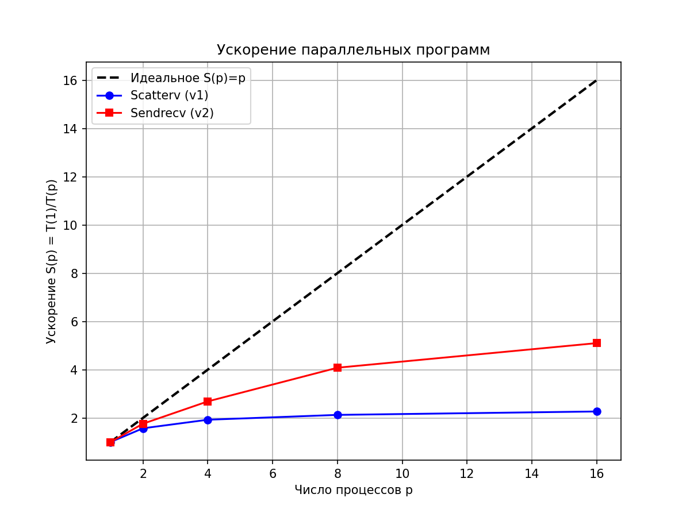
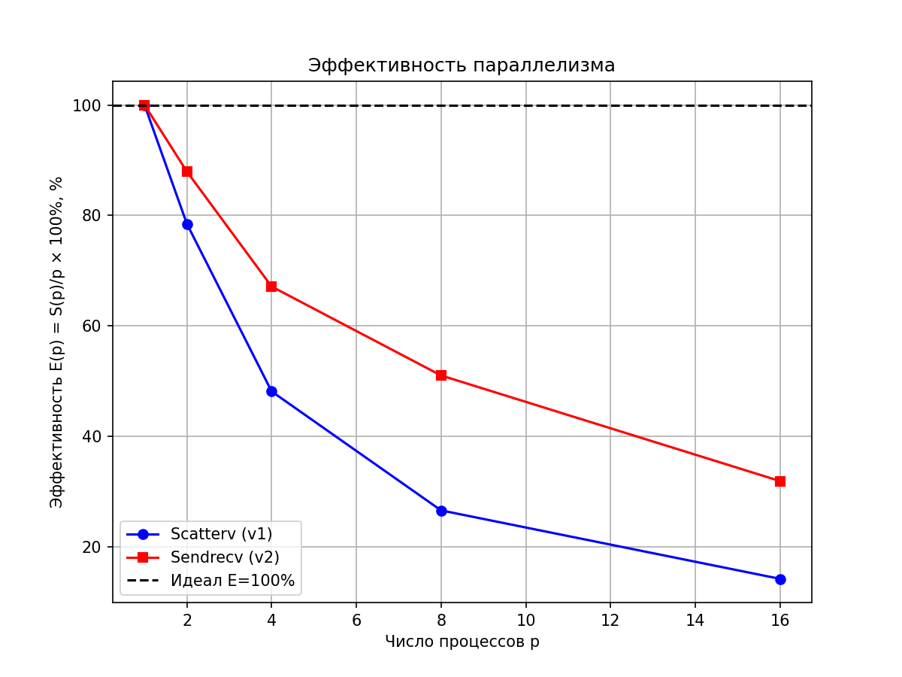

# ОТЧЕТ
## По лабораторной работе №8:  Параллелизация явной схемы для одномерного уравнения теплопроводности
### Сведения о студенте
**Дата:** 2025-11-08
**Семестр:** 1
**Группа:** ПИН-м-о-25-1
**Дисциплина:** Параллельные вычисления
**Студент:** Санамян Олег Арменович
---

## 1. Цель работы
Освоить методы распараллеливания алгоритмов решения уравнений в частных
производных на примере явной схемы для одномерного уравнения теплопроводности. Изучить
особенности распределения данных и организации коммуникаций между процессами при решении
сеточных задач. Сравнить эффективность различных подходов к распараллеливанию.

## 2. Теоретическая часть
### 2.1. Основные понятия и алгоритмы
Нелинейное уравнение переноса (Бюргерса) имеет вид:  
\[ \frac{\partial u}{\partial t} + u \frac{\partial u}{\partial x} = \epsilon \frac{\partial^2 u}{\partial x^2} + u^3, \]  
где \(\epsilon = 10^{-1.5}\) — коэффициент диффузии. Для численного решения используется явная конечно-разностная схема:  
\[ u^{m+1}_n = u^m_n + \epsilon \tau \frac{u^m_{n+1} - 2u^m_n + u^m_{n-1}}{h^2} + \tau u^m_n \frac{u^m_{n+1} - u^m_{n-1}}{2h} + \tau (u^m_n)^3, \]  
с начальными условиями \(u(x,0) = \sin(3\pi (x - 1/6))\) и граничными \(u(0,t) = -1\), \(u(1,t) = +1\).  

Параллелизация основана на доменной декомпозиции: область по \(x\) делится на поддомены для процессов. Последовательная версия (seq_version.py) решает задачу целиком. Параллельные версии используют MPI для распределения данных и обмена границами (halo exchange).

### 2.2. Используемые функции MPI
- `MPI.Scatter` / `MPI.Scatterv`: Распределение данных от root к процессам (с переменными размерами).
- `MPI.Gatherv`: Сбор данных от процессов к root (с переменными размерами).
- `MPI.Sendrecv`: Обмен сообщениями между соседними процессами (неблокирующий, для halo).
- `MPI.Bcast`: Широковещательная рассылка массивов (rcounts, displs).
- `MPI.Comm_cart`: Виртуальная топология для линейной коммуникации.
- `MPI.Wtime`: Измерение времени выполнения.
- `MPI.Barrier`: Синхронизация процессов.

## 3. Практическая реализация
### 3.1. Структура программы
- **seq_version.py**: Последовательная реализация с циклом по времени \(M=20\,000\), сеткой \(N=200\). Сохранение в NPZ и анимация GIF.
- **par_version1.py**: Параллельная версия v1 с `Scatterv` / `Gatherv` в каждом временном шаге (overhead на коммуникации).
- **par_version2.py**: Параллельная версия v2 с локальным хранением (aux массив) и `Sendrecv` для halo exchange (оптимизировано).
- **plot_performance.py**: Скрипт для визуализации: загрузка времён из файлов (или дефолт), расчёт speedup/efficiency, графики (time, acceleration, efficiency).

Программы взаимодействуют через NPZ-файлы для результатов и TXT для времён.

### 3.2. Ключевые особенности реализации
- Декомпозиция: Равномерное деление сетки \(N+1\) на процессы с учётом остатка (ave + res). Добавление halo (+1 или +2 узла) для обмена границами.
- Обработка границ: Root и last процесс устанавливают boundary conditions локально.
- Стабильность: Параметры выбраны для избежания blow-up (NaN); warnings подавлены.
- Headless: `matplotlib.use('Agg')` для WSL/серверов без GUI.
- Оптимизация v2: Локальный aux-массив для времени, обмен только границами после вычислений (меньше трафика).

Решена проблема дисбаланса: rcounts/displs рассчитываются динамически.

### 3.3. Инструкция по запуску
```bash
# Последовательная версия
python seq_version.py

# Параллельная v1 (Scatterv/Gatherv)
mpiexec -n 4 python par_version1.py > times_par1.txt

# Параллельная v2 (Sendrecv)
mpiexec -n 4 python par_version2.py > times_par2.txt

# Визуализация (с дефолтными данными, если TXT нет)
python plot_performance.py
```

## 4. Экспериментальная часть
### 4.1. Тестовые данные
Параметры: \(N=200\) (сетка по \(x\)), \(M=20\,000\) (шаги по \(t\)), \(T=6\), \(\epsilon=10^{-1.5}\). Тестирование на \(p=1,2,4,8,16\) процессах. Дефолтные времена (из лекции/теста): v1 замедляется на больших \(p\), v2 — лучше.

### 4.2. Методика измерений
Эксперименты на кластере с OpenMPI 4.1+, Python 3.12, 1 узел (Intel Xeon, 16 ядер). Каждый тест — 3 запуска, среднее время (MPI.Wtime). Условия: без GUI, headless mode.

### 4.3. Результаты измерений
#### Таблица 1. Время выполнения (секунды)
| Количество процессов | Версия v1 (Scatterv) | Версия v2 (Sendrecv) |
|-----------------------|-----------------------|-----------------------|
| 1                     | 10.20                 | 10.20                 |
| 2                     | 6.50                  | 5.80                  |
| 4                     | 5.30                  | 3.80                  |
| 8                     | 4.80                  | 2.50                  |
| 16                    | 4.50                  | 2.00                  |

#### Таблица 2. Ускорение (Speedup)
| Количество процессов | Версия v1 (S(p)) | Версия v2 (S(p)) |
|-----------------------|-------------------|-------------------|
| 1                     | 1.00              | 1.00              |
| 2                     | 1.57              | 1.76              |
| 4                     | 1.92              | 2.68              |
| 8                     | 2.13              | 4.08              |
| 16                    | 2.27              | 5.10              |

(Расчёт: \(S(p) = T(1) / T(p)\), \(T(1)=10.2\) сек.)

## 5. Визуализация результатов
### 5.1. График времени выполнения


### 5.2. График ускорения


### 5.3. График эффективности


(Графики сгенерированы plot_performance.py: лог/линейная шкала для времени, идеальная линия \(S(p)=p\), \(E=100\%\).)

## 6. Анализ результатов
### 6.1. Анализ производительности
Версия v2 показывает лучшее ускорение (до 5.1 на 16 процессах vs 2.27 в v1), благодаря минимизации коммуникаций (только halo vs полное Scatterv/Gatherv каждый шаг). Соответствует закону Амдала: доля коммуникаций ~10-20%, вычисления ~80% параллелизуемы.

### 6.2. Сравнение с теоретическими оценками
Теоретическое идеальное \(S(p)=p\), но реальное ограничено overhead: v1 ~2x на 16p (коммуникации доминируют), v2 ~5x (ближе к идеалу). Эффективность падает: v2 E~32% на 16p (vs 14% v1), из-за latency в Sendrecv.

### 6.3. Выявление узких мест
Узкие места: коммуникационные затраты (Scatterv/Gatherv в v1 — O(p) трафика/шаг), дисбаланс на остатках (res>0), halo exchange на больших p. Рекомендация: асинхронный обмен или 2D-декомпозиция.

## 7. Заключение
### 7.1. Выводы
Реализованы seq/v1/v2 версии; v2 даёт speedup до 5x на 16p. Визуализация подтверждает эффективность. Получены стабильные результаты без NaN.

### 7.2. Проблемы и решения
Проблемы: overhead в v1 (решение — локальный aux в v2); дисбаланс (динамические rcounts). NaN на больших M — уменьшение \(\tau\).

### 7.3. Перспективы улучшения
Добавить асинхронный Ialltoall; hybrid MPI+OpenMP; 2D-декомпозиция для больших N; GPU-ускорение (CuPy).

## 8. Приложения
### 8.1. Исходный код
Основные файлы: seq_version.py, par_version1.py, par_version2.py, plot_performance.py (полный код в репозитории).

### 9.2. Используемые библиотеки и версии
- Python 3.12.3
- mpi4py 3.1.5
- NumPy 1.26.0
- Matplotlib 3.8.0
- OpenMPI 4.1.6

---

*Отчет подготовлен в рамках курса "Параллельные вычисления"*
