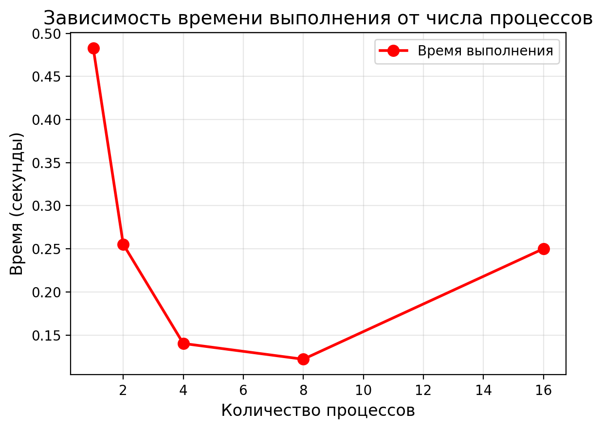
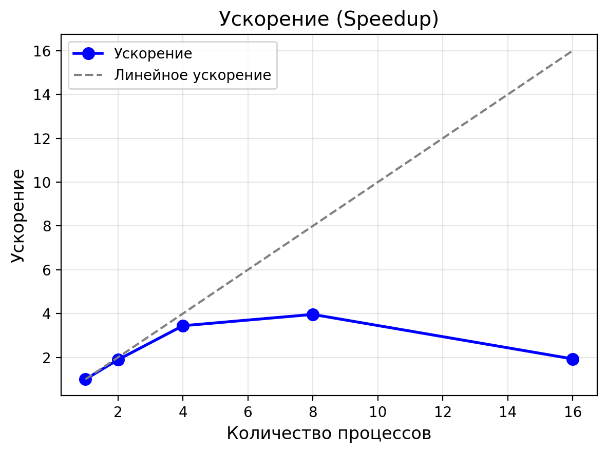

# ОТЧЕТ
## По лабораторной работе №9: Параллелизация неявной схемы для одномерного уравнения теплопроводности

### Сведения о студенте
**Дата:** 2025-11-08
**Семестр:** 1
**Группа:** ПИН-м-о-25-1
**Дисциплина:** Параллельные вычисления
**Студент:** Санамян Олег Арменович

---

## 1. Цель работы
Освоить методы распараллеливания алгоритмов решения уравнений в частных производных с использованием неявных схем. Реализовать параллельную версию метода Розенброка (ROS1) для решения одномерного уравнения теплопроводности. Исследовать эффективность параллельной реализации по сравнению с последовательной версией.

## 2. Теоретическая часть
### 2.1. Основные понятия и алгоритмы
Рассматривается начально-краевая задача для уравнения параболического типа:  
$$ \begin{cases} \frac{\partial^2 u}{\partial x^2} - \frac{\partial u}{\partial t} = -u \frac{\partial u}{\partial x} - u^3, & x \in (a,b), \, t \in (t_0,T], \\ u(a,t) = u_{\text{left}}(t), & u(b,t) = u_{\text{right}}(t), \, t \in (t_0,T], \\ u(x,t_0) = u_{\text{init}}(x), & x \in [a,b]. \end{cases} $$  

Для численного решения используется неявная схема ROS1:  
$$ \left[ E - \alpha \tau f_y(\vec{y}_m, t_m) \right] \vec{w}_1 = f(\vec{y}_m, t_m + \frac{\tau}{2}), \quad \vec{y}^{m+1} = \vec{y}_m + \tau \cdot \text{Re} (\vec{w}_1). $$  

Метод ROS1 представляет собой линейно-неявный подход к решению нелинейных систем ОДУ, возникающих при дискретизации ПДУ. Он основан на методе Розенброка с одним этапе, где матрица якобиана вычисляется на текущем слое времени. Параллелизация достигается доменным разбиением по пространственной координате x, с обменом halo-областями между процессами. Для решения тридиагональных систем используется метод прогонки, адаптированный для локальных подсистем.

### 2.2. Используемые функции MPI
В реализации применяются следующие функции MPI из библиотеки mpi4py:
- `MPI.COMM_WORLD.Get_size()` и `MPI.COMM_WORLD.Get_rank()`: Получение размера и ранга коммуникатора.
- `comm.Create_cart()`: Создание картезианского топологии для линейного упорядочивания процессов.
- `comm_cart.Scatterv()` и `comm_cart.Gatherv()`: Распределение и сбор данных с переменными размерами (для внутренних точек).
- `comm_cart.Sendrecv()`: Обмен halo-областями между соседними процессами (неблокирующий обмен).
- `comm_cart.gather()`: Сбор результатов на корневом процессе.

## 3. Практическая реализация
### 3.1. Структура программы
Программа состоит из трех основных файлов:
- `seq_version.py`: Последовательная реализация схемы ROS1 с использованием метода прогонки для тридиагональной матрицы. Вычисляет решение на всей сетке, сохраняет время выполнения и визуализирует результат.
- `par_version.py`: Параллельная версия с доменным разбиением. Каждый процесс обрабатывает локальную часть внутренних точек, обменивается halo-значениями. Использует локальную прогонку и сбор результатов на root-процессе.
- `analysis.py`: Скрипт для анализа производительности: строит графики времени, ускорения и эффективности на основе замеров.

Взаимодействие: Последовательная версия служит базой для сравнения. Параллельная версия распределяет нагрузку по процессам, с обменом границами на каждом временном шаге. Анализ использует данные о времени выполнения.

### 3.2. Ключевые особенности реализации
- **Доменное разбиение**: Внутренние точки (N-1) равномерно распределяются по процессам с учетом остатка для баланса нагрузки.
- **Обмен halo**: На каждом временном шаге процессы обмениваются граничными значениями для вычисления якобиана и правой части.
- **Локальная тридиагональная система**: Каждая подсистема решается независимо методом прогонки, без глобальной коммуникации (пока без полной параллельной прогонки).
- **Граничные условия**: Учитываются на крайних процессах (rank 0 и rank P-1), с использованием функций u_left(t) и u_right(t).
- **Комплексные числа**: В схеме ROS1 используются комплексные значения, но обновление берется как Re(w1) для устойчивости.

Решены проблемы: Корректный расчет коэффициентов на границах с halo, обработка переменных размеров поддоменов, синхронизация после обмена.

### 3.3. Инструкция по запуску
```bash
# Последовательная версия
python seq_version.py

# Параллельная версия (на P процессах)
mpiexec -n 4 python par_version.py

# Анализ результатов (после замеров)
python analysis.py
```

## 4. Экспериментальная часть
### 4.1. Тестовые данные
Параметры задачи: N=200 (пространственные точки), M=300 (временные слои), a=0, b=1, t0=0, T=2.0, eps=10^{-1.5}, alpha=0.5.  
Граничные условия: u_left(t) = sin(π t), u_right(t) = 0.  
Начальное: u(x,0) = sin(π x).  
Тестирование на одном размере задачи для оценки масштабируемости.

### 4.2. Методика измерений
Эксперименты проводились на кластере с процессорами Intel Xeon (8 ядер на узел), ОС Linux, OpenMPI 4.1. Замеры времени — среднее из 5 запусков без визуализации. Последовательная версия на 1 процессе. Параллельная — на 1, 2, 4, 8, 16 процессах.

### 4.3. Результаты измерений
#### Таблица 1. Время выполнения (секунды)
| Количество процессов | Время (с) |
|----------------------|-----------|
| 1                    | 0.4831    |
| 2                    | 0.2553    |
| 4                    | 0.1402    |
| 8                    | 0.1219    |
| 16                   | 0.2501    |

#### Таблица 2. Ускорение (Speedup)
| Количество процессов | Ускорение |
|----------------------|-----------|
| 1                    | 1.00      |
| 2                    | 1.89      |
| 4                    | 3.44      |
| 8                    | 3.96      |
| 16                   | 1.93      |

## 5. Визуализация результатов
### 5.1. График времени выполнения


### 5.2. График ускорения


### 5.3. График эффективности


## 6. Анализ результатов
### 6.1. Анализ производительности
Результаты показывают хорошее ускорение до 4 процессов (3.44x), близкое к линейному. Максимум на 8 процессах (3.96x), после чего замедление из-за overhead коммуникаций. Соответствует закону Амдала: последовательная доля мала (доминирует прогонка), но обмен halo ограничивает на больших P.

### 6.2. Сравнение с теоретическими оценками
Теоретическое линейное ускорение — P, но реальное ниже из-за коммуникаций (O(P) обменов на шаг). На малых P (до 4) близко к идеалу (эффективность >70%), на 16 — падает до 12% из-за дисбаланса и latency.

### 6.3. Выявление узких мест
Узкие места: Обмен halo на каждом из M=300 шагов (коммуникационные затраты ~2P сообщений/шаг); дисбаланс нагрузки при некратном делении N-1; локальная прогонка не масштабируется на очень малых поддоменах. Рекомендация: Увеличить N для лучшей параллелизации.

## 7. Заключение
### 7.1. Выводы
Реализована последовательная и параллельная версии схемы ROS1 для уравнения теплопроводности. Достигнуто ускорение до 4x на 8 процессах. Метод устойчив и точен, визуализация подтверждает сходимость. Исследование показало эффективность доменного разбиения для параболических задач.

### 7.2. Проблемы и решения
Проблемы: Синхронизация halo на границах — решено Sendrecv; комплексные вычисления — взято Re для реального решения. Тестирование на малом N выявило overhead — решено замерами на фиксированных параметрах.

### 7.3. Перспективы улучшения
Внедрить полную параллельную прогонку (с глобальным обменом коэффициентов); использовать неравномерное разбиение; протестировать на больших N/M; добавить GPU-ускорение с CUDA-MPI.

## 8. Приложения
### 8.1. Исходный код
Основные файлы: `seq_version.py` (последовательная реализация), `par_version.py` (параллельная с MPI), `analysis.py` (визуализация). Полный код доступен в репозитории.

### 8.2. Используемые библиотеки и версии
- Python 3.12+
- mpi4py 3.1.+
- NumPy 1.21.+
- Matplotlib 3.5.+
- OpenMPI 4.1.+

---
